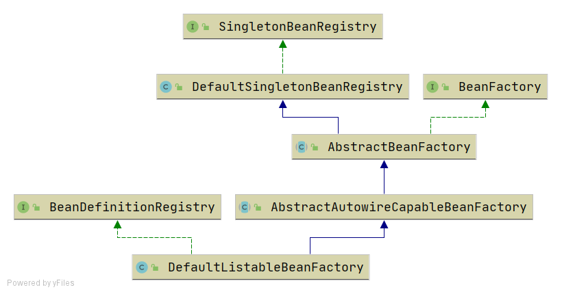
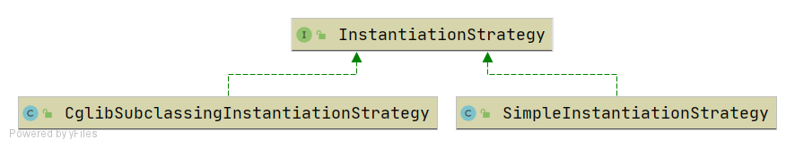
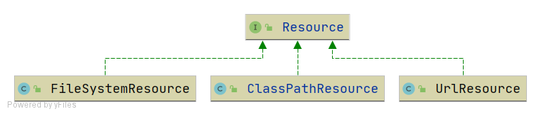
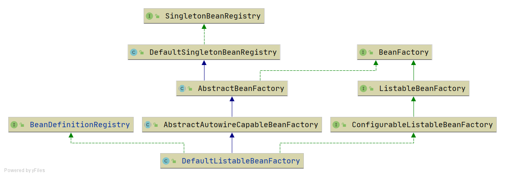
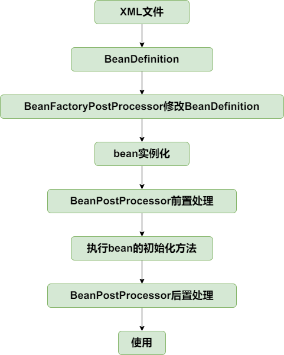
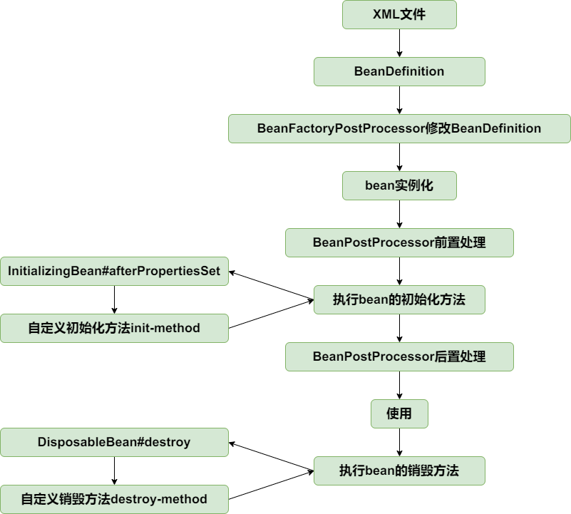
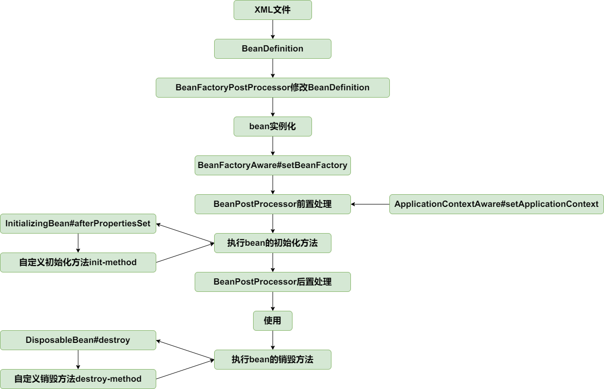
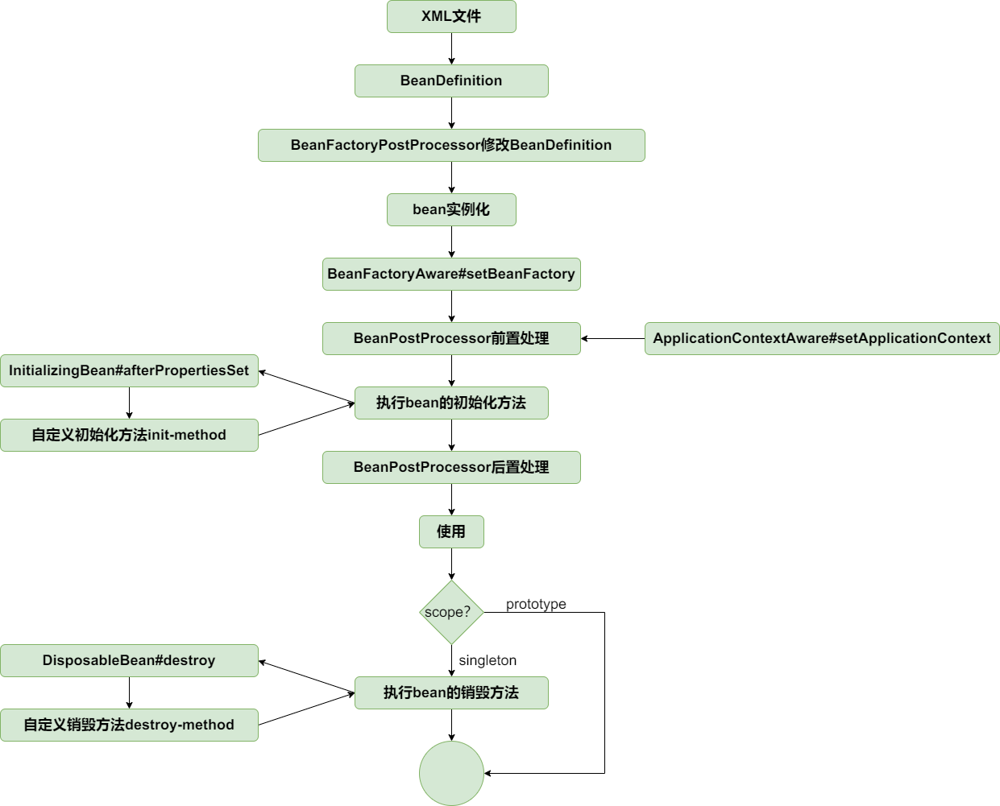
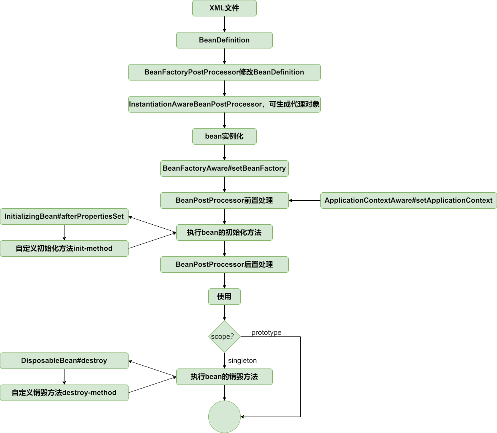
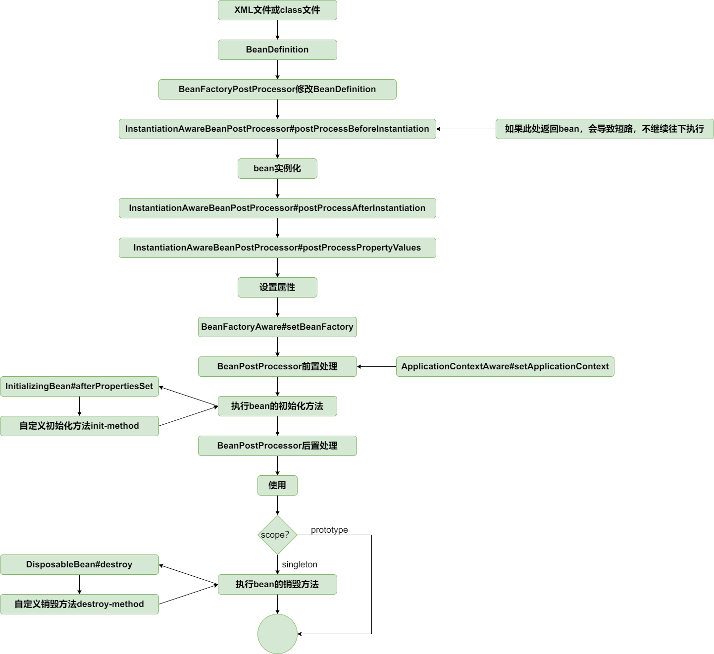

 # [基础篇：IoC](#基础篇IoC)
 ## [最简单的bean容器](#最简单的bean容器)
 > 分支：simple-bean-container

定义一个简单的bean容器BeanFactory，内部包含一个map用以保存bean，只有注册bean和获取bean两个方法
```
public class BeanFactory {
	private Map<String, Object> beanMap = new HashMap<>();

	public void registerBean(String name, Object bean) {
		beanMap.put(name, bean);
	}

	public Object getBean(String name) {
		return beanMap.get(name);
	}
}
```

测试：
```
public class SimpleBeanContainerTest {

	@Test
	public void testGetBean() throws Exception {
		BeanFactory beanFactory = new BeanFactory();
		beanFactory.registerBean("helloService", new HelloService());
		HelloService helloService = (HelloService) beanFactory.getBean("helloService");
		assertThat(helloService).isNotNull();
		assertThat(helloService.sayHello()).isEqualTo("hello");
	}

	class HelloService {
		public String sayHello() {
			System.out.println("hello");
			return "hello";
		}
	}
}
```

## [BeanDefinition和BeanDefinitionRegistry](#BeanDefinition和BeanDefinitionRegistry)
> 分支：bean-definition-and-bean-definition-registry

主要增加如下类：
- BeanDefinition，顾名思义，用于定义bean信息的类，包含bean的class类型、构造参数、属性值等信息，每个bean对应一个BeanDefinition的实例。简化BeanDefition仅包含bean的class类型。
- BeanDefinitionRegistry，BeanDefinition注册表接口，定义注册BeanDefintion的方法。
- SingletonBeanRegistry及其实现类DefaultSingletonBeanRegistry，定义添加和获取单例bean的方法。

bean容器作为BeanDefinitionRegistry和SingletonBeanRegistry的实现类，具备两者的能力。向bean容器中注册BeanDefintion后，使用bean时才会实例化。



测试：
```
public class BeanDefinitionAndBeanDefinitionRegistryTest {

	@Test
	public void testBeanFactory() throws Exception {
		DefaultListableBeanFactory beanFactory = new DefaultListableBeanFactory();
		BeanDefinition beanDefinition = new BeanDefinition(HelloService.class);
		beanFactory.registerBeanDefinition("helloService", beanDefinition);

		HelloService helloService = (HelloService) beanFactory.getBean("helloService");
		helloService.sayHello();
	}
}

class HelloService {
	public String sayHello() {
		System.out.println("hello");
		return "hello";
	}
}
```

## [Bean实例化策略InstantiationStrategy](#Bean实例化策略InstantiationStrategy)
> 分支：instantiation-strategy

现在bean是在AbstractAutowireCapableBeanFactory.doCreateBean方法中用beanClass.newInstance()来实例化，仅适用于bean有无参构造函数的情况。



针对bean的实例化，抽象出一个实例化策略的接口InstantiationStrategy，有两个实现类：
- SimpleInstantiationStrategy，使用bean的构造函数来实例化
- CglibSubclassingInstantiationStrategy，使用CGLIB动态生成子类

## [为bean填充属性](#为bean填充属性)
> 分支：populate-bean-with-property-values

在BeanDefinition中增加和bean属性对应的PropertyValues，实例化bean之后，为bean填充属性(AbstractAutowireCapableBeanFactory#applyPropertyValues)。

测试：
```
public class PopulateBeanWithPropertyValuesTest {

	@Test
	public void testPopulateBeanWithPropertyValues() throws Exception {
		DefaultListableBeanFactory beanFactory = new DefaultListableBeanFactory();
		PropertyValues propertyValues = new PropertyValues();
		propertyValues.addPropertyValue(new PropertyValue("name", "derek"));
		propertyValues.addPropertyValue(new PropertyValue("age", 18));
		BeanDefinition beanDefinition = new BeanDefinition(Person.class, propertyValues);
		beanFactory.registerBeanDefinition("person", beanDefinition);

		Person person = (Person) beanFactory.getBean("person");
		System.out.println(person);
		assertThat(person.getName()).isEqualTo("derek");
		assertThat(person.getAge()).isEqualTo(18);
	}
}
```

## [为bean注入bean](#为bean注入bean)
> 分支：populate-bean-with-bean

增加BeanReference类，包装一个bean对另一个bean的引用。实例化beanA后填充属性时，若PropertyValue#value为BeanReference，引用beanB，则先去实例化beanB。
由于不想增加代码的复杂度提高理解难度，暂时不支持循环依赖，后面会在高级篇中解决该问题。
```
protected void applyPropertyValues(String beanName, Object bean, BeanDefinition beanDefinition) {
    try {
        for (PropertyValue propertyValue : beanDefinition.getPropertyValues().getPropertyValues()) {
            String name = propertyValue.getName();
            Object value = propertyValue.getValue();
            if (value instanceof BeanReference) {
                // beanA依赖beanB，先实例化beanB
                BeanReference beanReference = (BeanReference) value;
                value = getBean(beanReference.getBeanName());
            }

            //通过反射设置属性
            BeanUtil.setFieldValue(bean, name, value);
        }
    } catch (Exception ex) {
        throw new BeansException("Error setting property values for bean: " + beanName, ex);
    }
}
```

测试：
```
public class PopulateBeanWithPropertyValuesTest {

	/**
	 * 为bean注入bean
	 *
	 * @throws Exception
	 */
	@Test
	public void testPopulateBeanWithBean() throws Exception {
		DefaultListableBeanFactory beanFactory = new DefaultListableBeanFactory();

		//注册Car实例
		PropertyValues propertyValuesForCar = new PropertyValues();
		propertyValuesForCar.addPropertyValue(new PropertyValue("brand", "porsche"));
		BeanDefinition carBeanDefinition = new BeanDefinition(Car.class, propertyValuesForCar);
		beanFactory.registerBeanDefinition("car", carBeanDefinition);

		//注册Person实例
		PropertyValues propertyValuesForPerson = new PropertyValues();
		propertyValuesForPerson.addPropertyValue(new PropertyValue("name", "derek"));
		propertyValuesForPerson.addPropertyValue(new PropertyValue("age", 18));
		//Person实例依赖Car实例
		propertyValuesForPerson.addPropertyValue(new PropertyValue("car", new BeanReference("car")));
		BeanDefinition beanDefinition = new BeanDefinition(Person.class, propertyValuesForPerson);
		beanFactory.registerBeanDefinition("person", beanDefinition);

		Person person = (Person) beanFactory.getBean("person");
		System.out.println(person);
		assertThat(person.getName()).isEqualTo("derek");
		assertThat(person.getAge()).isEqualTo(18);
		Car car = person.getCar();
		assertThat(car).isNotNull();
		assertThat(car.getBrand()).isEqualTo("porsche");
	}
}
```

## [资源和资源加载器](#资源和资源加载器)
> 分支：resource-and-resource-loader

Resource是资源的抽象和访问接口，简单写了三个实现类



- FileSystemResource，文件系统资源的实现类
- ClassPathResource，classpath下资源的实现类
- UrlResource，对java.net.URL进行资源定位的实现类

ResourceLoader接口则是资源查找定位策略的抽象，DefaultResourceLoader是其默认实现类

测试：
```
public class ResourceAndResourceLoaderTest {

	@Test
	public void testResourceLoader() throws Exception {
		DefaultResourceLoader resourceLoader = new DefaultResourceLoader();

		//加载classpath下的资源
		Resource resource = resourceLoader.getResource("classpath:hello.txt");
		InputStream inputStream = resource.getInputStream();
		String content = IoUtil.readUtf8(inputStream);
		System.out.println(content);
		assertThat(content).isEqualTo("hello world");

		//加载文件系统资源
		resource = resourceLoader.getResource("src/test/resources/hello.txt");
		assertThat(resource instanceof FileSystemResource).isTrue();
		inputStream = resource.getInputStream();
		content = IoUtil.readUtf8(inputStream);
		System.out.println(content);
		assertThat(content).isEqualTo("hello world");

		//加载url资源
		resource = resourceLoader.getResource("https://www.baidu.com");
		assertThat(resource instanceof UrlResource).isTrue();
		inputStream = resource.getInputStream();
		content = IoUtil.readUtf8(inputStream);
		System.out.println(content);
	}
}
```

## [在xml文件中定义bean](#在xml文件中定义bean)
> 分支：xml-file-define-bean

有了资源加载器，就可以在xml格式配置文件中声明式地定义bean的信息，资源加载器读取xml文件，解析出bean的信息，然后往容器中注册BeanDefinition。

BeanDefinitionReader是读取bean定义信息的抽象接口，XmlBeanDefinitionReader是从xml文件中读取的实现类。BeanDefinitionReader需要有获取资源的能力，且读取bean定义信息后需要往容器中注册BeanDefinition，因此BeanDefinitionReader的抽象实现类AbstractBeanDefinitionReader拥有ResourceLoader和BeanDefinitionRegistry两个属性。

由于从xml文件中读取的内容是String类型，所以属性仅支持String类型和引用其他Bean。后面会讲到属性编辑器PropertyEditor，实现类型转换。

为了方便后面的讲解和功能实现，并且尽量保持和spring中BeanFactory的继承层次一致，对BeanFactory的继承层次稍微做了调整。



测试：
bean定义文件spring.xml
```
<?xml version="1.0" encoding="UTF-8"?>
<beans xmlns="http://www.springframework.org/schema/beans"
       xmlns:xsi="http://www.w3.org/2001/XMLSchema-instance"
       xmlns:context="http://www.springframework.org/schema/context"
       xsi:schemaLocation="http://www.springframework.org/schema/beans
	         http://www.springframework.org/schema/beans/spring-beans.xsd
		 http://www.springframework.org/schema/context
		 http://www.springframework.org/schema/context/spring-context-4.0.xsd">

    <bean id="person" class="org.springframework.test.bean.Person">
        <property name="name" value="derek"/>
        <property name="car" ref="car"/>
    </bean>

    <bean id="car" class="org.springframework.test.bean.Car">
        <property name="brand" value="porsche"/>
    </bean>

</beans>
```

```
public class XmlFileDefineBeanTest {

	@Test
	public void testXmlFile() throws Exception {
		DefaultListableBeanFactory beanFactory = new DefaultListableBeanFactory();
		XmlBeanDefinitionReader beanDefinitionReader = new XmlBeanDefinitionReader(beanFactory);
		beanDefinitionReader.loadBeanDefinitions("classpath:spring.xml");

		Person person = (Person) beanFactory.getBean("person");
		System.out.println(person);
		assertThat(person.getName()).isEqualTo("derek");
		assertThat(person.getCar().getBrand()).isEqualTo("porsche");

		Car car = (Car) beanFactory.getBean("car");
		System.out.println(car);
		assertThat(car.getBrand()).isEqualTo("porsche");
	}
}
```

## [BeanFactoryPostProcess和BeanPostProcessor](#BeanFactoryPostProcess和BeanPostProcessor)
> 分支：bean-factory-post-processor-and-bean-post-processor

BeanFactoryPostProcess和BeanPostProcessor是spring框架中具有重量级地位的两个接口，理解了这两个接口的作用，基本就理解spring的核心原理了。为了降低理解难度分两个小节实现。

BeanFactoryPostProcessor是spring提供的容器扩展机制，允许我们在bean实例化之前修改bean的定义信息即BeanDefinition的信息。其重要的实现类有PropertyPlaceholderConfigurer和CustomEditorConfigurer，PropertyPlaceholderConfigurer的作用是用properties文件的配置值替换xml文件中的占位符，CustomEditorConfigurer的作用是实现类型转换。BeanFactoryPostProcessor的实现比较简单，看单元测试BeanFactoryPostProcessorAndBeanPostProcessorTest#testBeanFactoryPostProcessor追下代码。

BeanPostProcessor也是spring提供的容器扩展机制，不同于BeanFactoryPostProcessor的是，BeanPostProcessor在bean实例化后修改bean或替换bean。BeanPostProcessor是后面实现AOP的关键。

BeanPostProcessor的两个方法分别在bean执行初始化方法（后面实现）之前和之后执行，理解其实现重点看单元测试BeanFactoryPostProcessorAndBeanPostProcessorTest#testBeanPostProcessor和AbstractAutowireCapableBeanFactory#initializeBean方法，有些地方做了微调，可不必关注。

```
public interface BeanPostProcessor {
	/**
	 * 在bean执行初始化方法之前执行此方法
	 */
	Object postProcessBeforeInitialization(Object bean, String beanName) throws BeansException;

	/**
	 * 在bean执行初始化方法之后执行此方法
	 */
	Object postProcessAfterInitialization(Object bean, String beanName) throws BeansException;
}
```

下一节将引入ApplicationContext，能自动识别BeanFactoryPostProcessor和BeanPostProcessor，就可以在xml文件中配置而不需要手动添加到BeanFactory了。

测试：
```
public class BeanFactoryProcessorAndBeanPostProcessorTest {

	@Test
	public void testBeanFactoryPostProcessor() throws Exception {
		DefaultListableBeanFactory beanFactory = new DefaultListableBeanFactory();
		XmlBeanDefinitionReader beanDefinitionReader = new XmlBeanDefinitionReader(beanFactory);
		beanDefinitionReader.loadBeanDefinitions("classpath:spring.xml");

		//在所有BeanDefintion加载完成后，但在bean实例化之前，修改BeanDefinition的属性值
		CustomBeanFactoryPostProcessor beanFactoryPostProcessor = new CustomBeanFactoryPostProcessor();
		beanFactoryPostProcessor.postProcessBeanFactory(beanFactory);

		Person person = (Person) beanFactory.getBean("person");
		System.out.println(person);
		//name属性在CustomBeanFactoryPostProcessor中被修改为ivy
		assertThat(person.getName()).isEqualTo("ivy");
	}

	@Test
	public void testBeanPostProcessor() throws Exception {
		DefaultListableBeanFactory beanFactory = new DefaultListableBeanFactory();
		XmlBeanDefinitionReader beanDefinitionReader = new XmlBeanDefinitionReader(beanFactory);
		beanDefinitionReader.loadBeanDefinitions("classpath:spring.xml");

		//添加bean实例化后的处理器
		CustomerBeanPostProcessor customerBeanPostProcessor = new CustomerBeanPostProcessor();
		beanFactory.addBeanPostProcessor(customerBeanPostProcessor);

		Car car = (Car) beanFactory.getBean("car");
		System.out.println(car);
		//brand属性在CustomerBeanPostProcessor中被修改为lamborghini
		assertThat(car.getBrand()).isEqualTo("lamborghini");
	}
}
```

## [应用上下文ApplicationContext](#应用上下文ApplicationContext)
> 分支：application-context

应用上下文ApplicationContext是spring中较之于BeanFactory更为先进的IOC容器，ApplicationContext除了拥有BeanFactory的所有功能外，还支持特殊类型bean如上一节中的BeanFactoryPostProcessor和BeanPostProcessor的自动识别、资源加载、容器事件和监听器、国际化支持、单例bean自动初始化等。

BeanFactory是spring的基础设施，面向spring本身；而ApplicationContext面向spring的使用者，应用场合使用ApplicationContext。

具体实现查看AbstractApplicationContext#refresh方法即可。注意BeanFactoryPostProcessor和BeanPostProcessor的自定识别，这样就可以在xml文件中配置二者而不需要像上一节一样手动添加到容器中了。

从bean的角度看，目前生命周期如下：



测试：见ApplicationContextTest

## [bean的初始化和销毁方法](#bean的初始化和销毁方法)
> 分支：init-and-destroy-method

在spring中，定义bean的初始化和销毁方法有三种方法：
- 在xml文件中制定init-method和destroy-method
- 继承自InitializingBean和DisposableBean
- 在方法上加注解PostConstruct和PreDestroy

第三种通过BeanPostProcessor实现，在扩展篇中实现，本节只实现前两种。

针对第一种在xml文件中指定初始化和销毁方法的方式，在BeanDefinition中增加属性initMethodName和destroyMethodName。

初始化方法在AbstractAutowireCapableBeanFactory#invokeInitMethods执行。DefaultSingletonBeanRegistry中增加属性disposableBeans保存拥有销毁方法的bean，拥有销毁方法的bean在AbstractAutowireCapableBeanFactory#registerDisposableBeanIfNecessary中注册到disposableBeans中。

为了确保销毁方法在虚拟机关闭之前执行，向虚拟机中注册一个钩子方法，查看AbstractApplicationContext#registerShutdownHook（非web应用需要手动调用该方法）。当然也可以手动调用ApplicationContext#close方法关闭容器。

到此为止，bean的生命周期如下：



测试：
init-and-destroy-method.xml
```
<?xml version="1.0" encoding="UTF-8"?>
<beans xmlns="http://www.springframework.org/schema/beans"
       xmlns:xsi="http://www.w3.org/2001/XMLSchema-instance"
       xmlns:context="http://www.springframework.org/schema/context"
       xsi:schemaLocation="http://www.springframework.org/schema/beans
	         http://www.springframework.org/schema/beans/spring-beans.xsd
		 http://www.springframework.org/schema/context
		 http://www.springframework.org/schema/context/spring-context-4.0.xsd">

    <bean id="person" class="org.springframework.test.bean.Person" init-method="customInitMethod" destroy-method="customDestroyMethod">
        <property name="name" value="derek"/>
        <property name="car" ref="car"/>
    </bean>

    <bean id="car" class="org.springframework.test.bean.Car">
        <property name="brand" value="porsche"/>
    </bean>

</beans>
```
```
public class Person implements InitializingBean, DisposableBean {

	private String name;

	private int age;

	private Car car;

	public void customInitMethod() {
		System.out.println("I was born in the method named customInitMethod");
	}

	public void customDestroyMethod() {
		System.out.println("I died in the method named customDestroyMethod");
	}

	@Override
	public void afterPropertiesSet() throws Exception {
		System.out.println("I was born in the method named afterPropertiesSet");
	}

	@Override
	public void destroy() throws Exception {
		System.out.println("I died in the method named destroy");
	}

    //setter and getter
}
```
```
public class InitAndDestoryMethodTest {

	@Test
	public void testInitAndDestroyMethod() throws Exception {
		ClassPathXmlApplicationContext applicationContext = new ClassPathXmlApplicationContext("classpath:init-and-destroy-method.xml");
		applicationContext.registerShutdownHook();  //或者手动关闭 applicationContext.close();
	}
}
```

## [Aware接口](#Aware接口)
> 分支：aware-interface

Aware是感知、意识的意思，Aware接口是标记性接口，其实现子类能感知容器相关的对象。常用的Aware接口有BeanFactoryAware和ApplicationContextAware，分别能让其实现者感知所属的BeanFactory和ApplicationContext。

让实现BeanFactoryAware接口的类能感知所属的BeanFactory，实现比较简单，查看AbstractAutowireCapableBeanFactory#initializeBean前三行。

实现ApplicationContextAware的接口感知ApplicationContext，是通过BeanPostProcessor。由bean的生命周期可知，bean实例化后会经过BeanPostProcessor的前置处理和后置处理。定义一个BeanPostProcessor的实现类ApplicationContextAwareProcessor，在AbstractApplicationContext#refresh方法中加入到BeanFactory中，在前置处理中为bean设置所属的ApplicationContext。

改用dom4j解析xml文件。

至止，bean的生命周期如下：



测试：
spring.xml
```
<?xml version="1.0" encoding="UTF-8"?>
<beans xmlns="http://www.springframework.org/schema/beans"
       xmlns:xsi="http://www.w3.org/2001/XMLSchema-instance"
       xmlns:context="http://www.springframework.org/schema/context"
       xsi:schemaLocation="http://www.springframework.org/schema/beans
	         http://www.springframework.org/schema/beans/spring-beans.xsd
		 http://www.springframework.org/schema/context
		 http://www.springframework.org/schema/context/spring-context-4.0.xsd">

    <bean id="helloService" class="org.springframework.test.service.HelloService"/>

</beans>
```
```
public class HelloService implements ApplicationContextAware, BeanFactoryAware {

	private ApplicationContext applicationContext;

	private BeanFactory beanFactory;

	@Override
	public void setBeanFactory(BeanFactory beanFactory) throws BeansException {
		this.beanFactory = beanFactory;
	}

	@Override
	public void setApplicationContext(ApplicationContext applicationContext) throws BeansException {
		this.applicationContext = applicationContext;
	}

	public ApplicationContext getApplicationContext() {
		return applicationContext;
	}

	public BeanFactory getBeanFactory() {
		return beanFactory;
	}
}
```
```
public class AwareInterfaceTest {

	@Test
	public void test() throws Exception {
		ClassPathXmlApplicationContext applicationContext = new ClassPathXmlApplicationContext("classpath:spring.xml");
		HelloService helloService = applicationContext.getBean("helloService", HelloService.class);
		assertThat(helloService.getApplicationContext()).isNotNull();
		assertThat(helloService.getBeanFactory()).isNotNull();
	}
}
```

## [bean作用域，增加prototype的支持](#bean作用域增加prototype的支持)
> 分支：prototype-bean

每次向容器获取prototype作用域bean时，容器都会创建一个新的实例。在BeanDefinition中增加描述bean的作用域的字段scope/singleton/prototype，创建prototype作用域bean时（AbstractAutowireCapableBeanFactory#doCreateBean），不往singletonObjects中增加该bean。prototype作用域bean不执行销毁方法，查看AbstractAutowireCapableBeanFactory#registerDisposableBeanIfNecessary方法。

至止，bean的生命周期如下：



测试：
prototype-bean.xml
```
<?xml version="1.0" encoding="UTF-8"?>
<beans xmlns="http://www.springframework.org/schema/beans"
       xmlns:xsi="http://www.w3.org/2001/XMLSchema-instance"
       xmlns:context="http://www.springframework.org/schema/context"
       xsi:schemaLocation="http://www.springframework.org/schema/beans
	         http://www.springframework.org/schema/beans/spring-beans.xsd
		 http://www.springframework.org/schema/context
		 http://www.springframework.org/schema/context/spring-context-4.0.xsd">

    <bean id="car" class="org.springframework.test.bean.Car" scope="prototype">
        <property name="brand" value="porsche"/>
    </bean>

</beans>
```
```
public class PrototypeBeanTest {

	@Test
	public void testPrototype() throws Exception {
		ClassPathXmlApplicationContext applicationContext = new ClassPathXmlApplicationContext("classpath:prototype-bean.xml");

		Car car1 = applicationContext.getBean("car", Car.class);
		Car car2 = applicationContext.getBean("car", Car.class);
		assertThat(car1 != car2).isTrue();
	}
}
```

## [FactoryBean](#FactoryBean)
> 分支：factory-bean

FactoryBean是一种特殊的bean，当向容器获取该bean时，容器不是返回其本身，而是返回其FactoryBean#getObject方法的返回值，可通过编码方式定义复杂的bean。

实现逻辑比较简单，当容器发现bean为FactoryBean类型时，调用其getObject方法返回最终bean。当FactoryBean#isSingleton==true，将最终bean放进缓存中，下次从缓存中获取。改动点见AbstractBeanFactory#getBean。

测试：
factory-bean.xml
```
<?xml version="1.0" encoding="UTF-8"?>
<beans xmlns="http://www.springframework.org/schema/beans"
       xmlns:xsi="http://www.w3.org/2001/XMLSchema-instance"
       xmlns:context="http://www.springframework.org/schema/context"
       xsi:schemaLocation="http://www.springframework.org/schema/beans
	         http://www.springframework.org/schema/beans/spring-beans.xsd
		 http://www.springframework.org/schema/context
		 http://www.springframework.org/schema/context/spring-context-4.0.xsd">

    <bean id="car" class="org.springframework.test.common.CarFactoryBean">
        <property name="brand" value="porsche"/>
    </bean>

</beans>
```
```
public class CarFactoryBean implements FactoryBean<Car> {

	private String brand;

	@Override
	public Car getObject() throws Exception {
		Car car = new Car();
		car.setBrand(brand);
		return car;
	}

	@Override
	public boolean isSingleton() {
		return true;
	}

	public void setBrand(String brand) {
		this.brand = brand;
	}
}
```
```
public class FactoryBeanTest {

	@Test
	public void testFactoryBean() throws Exception {
		ClassPathXmlApplicationContext applicationContext = new ClassPathXmlApplicationContext("classpath:factory-bean.xml");

		Car car = applicationContext.getBean("car", Car.class);
		applicationContext.getBean("car");
		assertThat(car.getBrand()).isEqualTo("porsche");
	}
}
```

## [容器事件和事件监听器](#容器事件和事件监听器)
> 分支：event-and-event-listener

ApplicationContext容器提供了完善的时间发布和时间监听功能。

ApplicationEventMulticaster接口是注册监听器和发布事件的抽象接口，AbstractApplicationContext包含其实现类实例作为其属性，使得ApplicationContext容器具有注册监听器和发布事件的能力。在AbstractApplicationContext#refresh方法中，会实例化ApplicationEventMulticaster、注册监听器并发布容器刷新事件ContextRefreshedEvent；在AbstractApplicationContext#doClose方法中，发布容器关闭事件ContextClosedEvent。

测试：
event-and-event-listener.xml
```
<?xml version="1.0" encoding="UTF-8"?>
<beans xmlns="http://www.springframework.org/schema/beans"
       xmlns:xsi="http://www.w3.org/2001/XMLSchema-instance"
       xmlns:context="http://www.springframework.org/schema/context"
       xsi:schemaLocation="http://www.springframework.org/schema/beans
	         http://www.springframework.org/schema/beans/spring-beans.xsd
		 http://www.springframework.org/schema/context
		 http://www.springframework.org/schema/context/spring-context-4.0.xsd">

    <bean class="org.springframework.test.common.event.ContextRefreshedEventListener"/>

    <bean class="org.springframework.test.common.event.CustomEventListener"/>

    <bean class="org.springframework.test.common.event.ContextClosedEventListener"/>
</beans>
```
```
public class EventAndEventListenerTest {

	@Test
	public void testEventListener() throws Exception {
		ClassPathXmlApplicationContext applicationContext = new ClassPathXmlApplicationContext("classpath:event-and-event-listener.xml");
		applicationContext.publishEvent(new CustomEvent(applicationContext));

		applicationContext.registerShutdownHook();//或者applicationContext.close()主动关闭容器;
	}
}
```
观察输出：
```
org.springframework.test.common.event.ContextRefreshedEventListener
org.springframework.test.common.event.CustomEventListener
org.springframework.test.common.event.ContextClosedEventListener
```

# [基础篇：AOP](#基础篇AOP)

## [切点表达式](#切点表达式)
> 分支：pointcut-expression

Joinpoint，织入点，指需要执行代理操作的某个类的某个方法(仅支持方法级别的JoinPoint)；Pointcut是JoinPoint的表述方式，能捕获JoinPoint。

最常用的切点表达式是AspectJ的切点表达式。需要匹配类，定义ClassFilter接口；匹配方法，定义MethodMatcher接口。PointCut需要同时匹配类和方法，包含ClassFilter和MethodMatcher，AspectJExpressionPointcut是支持AspectJ切点表达式的PointCut实现，简单实现仅支持execution函数。

测试：
```
public class HelloService {
	public String sayHello() {
		System.out.println("hello");
		return "hello";
	}
}
```
```
public class PointcutExpressionTest {

	@Test
	public void testPointcutExpression() throws Exception {
		AspectJExpressionPointcut pointcut = new AspectJExpressionPointcut("execution(* org.springframework.test.service.HelloService.*(..))");
		Class<HelloService> clazz = HelloService.class;
		Method method = clazz.getDeclaredMethod("sayHello");

		assertThat(pointcut.matches(clazz)).isTrue();
		assertThat(pointcut.matches(method, clazz)).isTrue();
	}
}
```

## [基于JDK的动态代理](#基于JDK的动态代理)
> 分支：jdk-dynamic-proxy

AopProxy是获取代理对象的抽象接口，JdkDynamicAopProxy的基于JDK动态代理的具体实现。TargetSource，被代理对象的封装。MethodInterceptor，方法拦截器，是AOP Alliance的"公民"，顾名思义，可以拦截方法，可在被代理执行的方法前后增加代理行为。

测试;
```
public class DynamicProxyTest {

	@Test
	public void testJdkDynamicProxy() throws Exception {
		WorldService worldService = new WorldServiceImpl();

		AdvisedSupport advisedSupport = new AdvisedSupport();
		TargetSource targetSource = new TargetSource(worldService);
		WorldServiceInterceptor methodInterceptor = new WorldServiceInterceptor();
		MethodMatcher methodMatcher = new AspectJExpressionPointcut("execution(* org.springframework.test.service.WorldService.explode(..))").getMethodMatcher();
		advisedSupport.setTargetSource(targetSource);
		advisedSupport.setMethodInterceptor(methodInterceptor);
		advisedSupport.setMethodMatcher(methodMatcher);

		WorldService proxy = (WorldService) new JdkDynamicAopProxy(advisedSupport).getProxy();
		proxy.explode();
	}
}
```

## [基于CGLIB的动态代理](#基于CGLIB的动态代理)
> 分支：cglib-dynamic-proxy

基于CGLIB的动态代理实现逻辑也比较简单，查看CglibAopProxy。与基于JDK的动态代理在运行期间为接口生成对象的代理对象不同，基于CGLIB的动态代理能在运行期间动态构建字节码的class文件，为类生成子类，因此被代理类不需要继承自任何接口。

测试：
```
public class DynamicProxyTest {

	private AdvisedSupport advisedSupport;

	@Before
	public void setup() {
		WorldService worldService = new WorldServiceImpl();

		advisedSupport = new AdvisedSupport();
		TargetSource targetSource = new TargetSource(worldService);
		WorldServiceInterceptor methodInterceptor = new WorldServiceInterceptor();
		MethodMatcher methodMatcher = new AspectJExpressionPointcut("execution(* org.springframework.test.service.WorldService.explode(..))").getMethodMatcher();
		advisedSupport.setTargetSource(targetSource);
		advisedSupport.setMethodInterceptor(methodInterceptor);
		advisedSupport.setMethodMatcher(methodMatcher);
	}

	@Test
	public void testCglibDynamicProxy() throws Exception {
		WorldService proxy = (WorldService) new CglibAopProxy(advisedSupport).getProxy();
		proxy.explode();
	}
}
```

## [AOP代理工厂](#AOP代理工厂)
> 分支：proxy-factory

增加AOP代理工厂ProxyFactory，由AdvisedSupport#proxyTargetClass属性决定使用JDK动态代理还是CGLIB动态代理。

测试：
```
public class DynamicProxyTest {

	private AdvisedSupport advisedSupport;

	@Before
	public void setup() {
		WorldService worldService = new WorldServiceImpl();

		advisedSupport = new AdvisedSupport();
		TargetSource targetSource = new TargetSource(worldService);
		WorldServiceInterceptor methodInterceptor = new WorldServiceInterceptor();
		MethodMatcher methodMatcher = new AspectJExpressionPointcut("execution(* org.springframework.test.service.WorldService.explode(..))").getMethodMatcher();
		advisedSupport.setTargetSource(targetSource);
		advisedSupport.setMethodInterceptor(methodInterceptor);
		advisedSupport.setMethodMatcher(methodMatcher);
	}

	@Test
	public void testProxyFactory() throws Exception {
		// 使用JDK动态代理
		advisedSupport.setProxyTargetClass(false);
		WorldService proxy = (WorldService) new ProxyFactory(advisedSupport).getProxy();
		proxy.explode();

		// 使用CGLIB动态代理
		advisedSupport.setProxyTargetClass(true);
		proxy = (WorldService) new ProxyFactory(advisedSupport).getProxy();
		proxy.explode();
	}
}
```

## [几种常用的Advice：BeforeAdvice/AfterAdvice/AfterReturningAdvice/ThrowsAdvice...](#几种常用的AdviceBeforeAdviceAfterAdviceAfterReturningAdviceThrowsAdvice)
> 分支： common-advice

Spring将AOP联盟中的Advice细化出各种类型的Advice，常用的有BeforeAdvice/AfterAdvice/AfterReturningAdvice/ThrowsAdvice，我们可以通过扩展MethodInterceptor来实现。

只简单实现BeforeAdvice，有兴趣的同学可以帮忙实现另外几种Advice。定义MethodBeforeAdviceInterceptor拦截器，在执行被代理方法之前，先执行BeforeAdvice的方法。
- [x] BeforeAdvice
- [ ] AfterAdvice
- [ ] AfterReturningAdvice
- [ ] ThrowsAdvice   

测试：
```
public class WorldServiceBeforeAdvice implements MethodBeforeAdvice {

	@Override
	public void before(Method method, Object[] args, Object target) throws Throwable {
		System.out.println("BeforeAdvice: do something before the earth explodes");
	}
}
```
```
public class DynamicProxyTest {

	private AdvisedSupport advisedSupport;

	@Before
	public void setup() {
		WorldService worldService = new WorldServiceImpl();

		advisedSupport = new AdvisedSupport();
		TargetSource targetSource = new TargetSource(worldService);
		MethodMatcher methodMatcher = new AspectJExpressionPointcut("execution(* org.springframework.test.service.WorldService.explode(..))").getMethodMatcher();
		advisedSupport.setTargetSource(targetSource);
		advisedSupport.setMethodMatcher(methodMatcher);
	}

	@Test
	public void testBeforeAdvice() throws Exception {
		//设置BeforeAdvice
		WorldServiceBeforeAdvice beforeAdvice = new WorldServiceBeforeAdvice();
		MethodBeforeAdviceInterceptor methodInterceptor = new MethodBeforeAdviceInterceptor(beforeAdvice);
		advisedSupport.setMethodInterceptor(methodInterceptor);

		WorldService proxy = (WorldService) new ProxyFactory(advisedSupport).getProxy();
		proxy.explode();
	}
}
```

## [PointcutAdvisor：Pointcut和Advice的组合](#PointcutAdvisorPointcut和Advice的组合)
> 分支：pointcut-advisor

Advisor是包含一个Pointcut和一个Advice的组合，Pointcut用于捕获JoinPoint，Advice决定在JoinPoint执行某种操作。实现了一个支持aspectj表达式的AspectJExpressionPointcutAdvisor。

测试：
```
public class DynamicProxyTest {

	@Test
	public void testAdvisor() throws Exception {
		WorldService worldService = new WorldServiceImpl();

		//Advisor是Pointcut和Advice的组合
		String expression = "execution(* org.springframework.test.service.WorldService.explode(..))";
		AspectJExpressionPointcutAdvisor advisor = new AspectJExpressionPointcutAdvisor();
		advisor.setExpression(expression);
		MethodBeforeAdviceInterceptor methodInterceptor = new MethodBeforeAdviceInterceptor(new WorldServiceBeforeAdvice());
		advisor.setAdvice(methodInterceptor);

		ClassFilter classFilter = advisor.getPointcut().getClassFilter();
		if (classFilter.matches(worldService.getClass())) {
			AdvisedSupport advisedSupport = new AdvisedSupport();
			TargetSource targetSource = new TargetSource(worldService);
			advisedSupport.setTargetSource(targetSource);
			advisedSupport.setMethodInterceptor((MethodInterceptor) advisor.getAdvice());
			advisedSupport.setMethodMatcher(advisor.getPointcut().getMethodMatcher());
//			advisedSupport.setProxyTargetClass(true);   //JDK or CGLIB

			WorldService proxy = (WorldService) new ProxyFactory(advisedSupport).getProxy();
			proxy.explode();
		}
	}
}
```

## [动态代理融入bean生命周期](#动态代理融入bean生命周期)
> 分支：auto-proxy

结合前面讲解的bean的生命周期，BeanPostProcessor处理阶段可以修改和替换bean，正好可以在此阶段返回代理对象替换原对象。不过我们引入一种特殊的BeanPostProcessor——InstantiationAwareBeanPostProcessor，如果InstantiationAwareBeanPostProcessor处理阶段返回代理对象，会导致短路，不会继续走原来的创建bean的流程，具体实现查看AbstractAutowireCapableBeanFactory#resolveBeforeInstantiation。

DefaultAdvisorAutoProxyCreator是处理横切逻辑的织入返回代理对象的InstantiationAwareBeanPostProcessor实现类，当对象实例化时，生成代理对象并返回。

至此，bean的生命周期如下：



测试：
auto-proxy.xml
```
<?xml version="1.0" encoding="UTF-8"?>
<beans xmlns="http://www.springframework.org/schema/beans"
       xmlns:xsi="http://www.w3.org/2001/XMLSchema-instance"
       xmlns:context="http://www.springframework.org/schema/context"
       xsi:schemaLocation="http://www.springframework.org/schema/beans
	         http://www.springframework.org/schema/beans/spring-beans.xsd
		 http://www.springframework.org/schema/context
		 http://www.springframework.org/schema/context/spring-context-4.0.xsd">

    <bean id="worldService" class="org.springframework.test.service.WorldServiceImpl"/>

    <bean class="org.springframework.aop.framework.autoproxy.DefaultAdvisorAutoProxyCreator"/>

    <bean id="pointcutAdvisor" class="org.springframework.aop.aspectj.AspectJExpressionPointcutAdvisor">
        <property name="expression" value="execution(* org.springframework.test.service.WorldService.explode(..))"/>
        <property name="advice" ref="methodInterceptor"/>
    </bean>


    <bean id="methodInterceptor" class="org.springframework.aop.framework.adapter.MethodBeforeAdviceInterceptor">
        <property name="advice" ref="beforeAdvice"/>
    </bean>

    <bean id="beforeAdvice" class="org.springframework.test.common.WorldServiceBeforeAdvice"/>

</beans>
```
```
public class AutoProxyTest {

	@Test
	public void testAutoProxy() throws Exception {
		ClassPathXmlApplicationContext applicationContext = new ClassPathXmlApplicationContext("classpath:auto-proxy.xml");

		//获取代理对象
		WorldService worldService = applicationContext.getBean("worldService", WorldService.class);
		worldService.explode();
	}
}
```

# [扩展篇](#扩展篇)

## [PropertyPlaceholderConfigurer](#PropertyPlaceholderConfigurer)
> 分支：property-placeholder-configurer

经常需要将配置信息配置在properties文件中，然后在XML文件中以占位符的方式引用。

实现思路很简单，在bean实例化之前，编辑BeanDefinition，解析XML文件中的占位符，然后用properties文件中的配置值替换占位符。而BeanFactoryPostProcessor具有编辑BeanDefinition的能力，因此PropertyPlaceholderConfigurer继承自BeanFactoryPostProcessor。

测试：
car.properties
```
brand=lamborghini
```
```
<?xml version="1.0" encoding="UTF-8"?>
<beans xmlns="http://www.springframework.org/schema/beans"
       xmlns:xsi="http://www.w3.org/2001/XMLSchema-instance"
       xmlns:context="http://www.springframework.org/schema/context"
       xsi:schemaLocation="http://www.springframework.org/schema/beans
	         http://www.springframework.org/schema/beans/spring-beans.xsd
		 http://www.springframework.org/schema/context
		 http://www.springframework.org/schema/context/spring-context-4.0.xsd">

    <bean class="org.springframework.beans.factory.PropertyPlaceholderConfigurer">
        <property name="location" value="classpath:car.properties" />
    </bean>

    <bean id="car" class="org.springframework.test.bean.Car">
        <property name="brand" value="${brand}" />
    </bean>

</beans>
```
```
public class PropertyPlaceholderConfigurerTest {

	@Test
	public void test() throws Exception {
		ClassPathXmlApplicationContext applicationContext = new ClassPathXmlApplicationContext("classpath:property-placeholder-configurer.xml");

		Car car = applicationContext.getBean("car", Car.class);
		assertThat(car.getBrand()).isEqualTo("lamborghini");
	}
}
```

## [包扫描](#包扫描)
> 分支：package-scan

结合bean的生命周期，包扫描只不过是扫描特定注解的类，提取类的相关信息组装成BeanDefinition注册到容器中。

在XmlBeanDefinitionReader中解析```<context:component-scan />```标签，扫描类组装BeanDefinition然后注册到容器中的操作在ClassPathBeanDefinitionScanner#doScan中实现。

测试：
```
@Component
public class Car {

}
```
package-scan.xml
```
<?xml version="1.0" encoding="UTF-8"?>
<beans xmlns="http://www.springframework.org/schema/beans"
       xmlns:xsi="http://www.w3.org/2001/XMLSchema-instance"
       xmlns:context="http://www.springframework.org/schema/context"
       xsi:schemaLocation="http://www.springframework.org/schema/beans
	         http://www.springframework.org/schema/beans/spring-beans.xsd
		 http://www.springframework.org/schema/context
		 http://www.springframework.org/schema/context/spring-context-4.0.xsd">

    <context:component-scan base-package="org.springframework.test.bean"/>

</beans>
```
```
public class PackageScanTest {

	@Test
	public void testScanPackage() throws Exception {
		ClassPathXmlApplicationContext applicationContext = new ClassPathXmlApplicationContext("classpath:package-scan.xml");

		Car car = applicationContext.getBean("car", Car.class);
		assertThat(car).isNotNull();
	}
}
```

## [@Value注解](#Value注解)
> 分支：value-annotation

注解@Value和@Autowired通过BeanPostProcessor处理。InstantiationAwareBeanPostProcessor增加postProcessPropertyValues方法，在bean实例化之后设置属性之前执行，查看AbstractAutowireCapableBeanFactory#doCreateBean方法。

增加AutowiredAnnotationBeanPostProcessor用于处理注解@Value，@Autowired的处理在下一节实现，在ClassPathBeanDefinitionScanner#doScan将其添加到容器中。查看AutowiredAnnotationBeanPostProcessor#postProcessPropertyValues，其中字符解析器StringValueResolver在PropertyPlaceholderConfigurer中添加到BeanFactory中。

测试：
```
@Component
public class Car {

	@Value("${brand}")
	private String brand;
}
```
value-annotation.xml
```
<?xml version="1.0" encoding="UTF-8"?>
<beans xmlns="http://www.springframework.org/schema/beans"
       xmlns:xsi="http://www.w3.org/2001/XMLSchema-instance"
       xmlns:context="http://www.springframework.org/schema/context"
       xsi:schemaLocation="http://www.springframework.org/schema/beans
	         http://www.springframework.org/schema/beans/spring-beans.xsd
		 http://www.springframework.org/schema/context
		 http://www.springframework.org/schema/context/spring-context-4.0.xsd">

    <bean class="org.springframework.beans.factory.PropertyPlaceholderConfigurer">
        <property name="location" value="classpath:car.properties" />
    </bean>

    <context:component-scan base-package="org.springframework.test.bean"/>

</beans>
```
car.properties
```
brand=lamborghini
```
```
public class ValueAnnotationTest {

	@Test
	public void testValueAnnotation() throws Exception {
		ClassPathXmlApplicationContext applicationContext = new ClassPathXmlApplicationContext("classpath:value-annotation.xml");

		Car car = applicationContext.getBean("car", Car.class);
		assertThat(car.getBrand()).isEqualTo("lamborghini");
	}
}

```

## [@Autowired注解](#Autowired注解)
> 分支：autowired-annotation

@Autowired注解的处理见AutowiredAnnotationBeanPostProcessor#postProcessPropertyValues

测试：
```
@Component
public class Car {

}

@Component
public class Person implements InitializingBean, DisposableBean {

	@Autowired
	private Car car;
}
```
autowired-annotation.xml
```
<?xml version="1.0" encoding="UTF-8"?>
<beans xmlns="http://www.springframework.org/schema/beans"
       xmlns:xsi="http://www.w3.org/2001/XMLSchema-instance"
       xmlns:context="http://www.springframework.org/schema/context"
       xsi:schemaLocation="http://www.springframework.org/schema/beans
	         http://www.springframework.org/schema/beans/spring-beans.xsd
		 http://www.springframework.org/schema/context
		 http://www.springframework.org/schema/context/spring-context-4.0.xsd">

    <context:component-scan base-package="org.springframework.test.bean"/>

</beans>
```
```
public class AutowiredAnnotationTest {

	@Test
	public void testAutowiredAnnotation() throws Exception {
		ClassPathXmlApplicationContext applicationContext = new ClassPathXmlApplicationContext("classpath:autowired-annotation.xml");

		Person person = applicationContext.getBean(Person.class);
		assertThat(person.getCar()).isNotNull();
	}
}
```
## [bug fix：没有为代理bean设置属性（discovered and fixed by @kerwin89）](#bug-fix没有为代理bean设置属性discovered-and-fixed-by-kerwin89)
> 分支: populate-proxy-bean-with-property-values

问题现象：没有为代理bean设置属性

问题原因：织入逻辑在InstantiationAwareBeanPostProcessor#postProcessBeforeInstantiation中执行，而该方法如果返回非null，会导致"短路"，不会执行后面的设置属性逻辑。因此如果该方法中返回代理bean后，不会为代理bean设置属性。

修复方案：跟spring保持一致，将织入逻辑迁移到BeanPostProcessor#postProcessAfterInitialization，即将DefaultAdvisorAutoProxyCreator#postProcessBeforeInstantiation的内容迁移到DefaultAdvisorAutoProxyCreator#postProcessAfterInitialization中。

顺便完善spring的扩展机制，为InstantiationAwareBeanPostProcessor增加postProcessAfterInstantiation方法，该方法在bean实例化之后设置属性之前执行。

至此，bean的生命周期比较完整了，如下：



测试：
populate-proxy-bean-with-property-values.xml
```
<?xml version="1.0" encoding="UTF-8"?>
<beans xmlns="http://www.springframework.org/schema/beans"
       xmlns:xsi="http://www.w3.org/2001/XMLSchema-instance"
       xmlns:context="http://www.springframework.org/schema/context"
       xsi:schemaLocation="http://www.springframework.org/schema/beans
	         http://www.springframework.org/schema/beans/spring-beans.xsd
		 http://www.springframework.org/schema/context
		 http://www.springframework.org/schema/context/spring-context-4.0.xsd">

    <bean id="worldService" class="org.springframework.test.service.WorldServiceImpl">
        <property name="name" value="earth"/>
    </bean>

    <bean class="org.springframework.aop.framework.autoproxy.DefaultAdvisorAutoProxyCreator"/>

    <bean id="pointcutAdvisor" class="org.springframework.aop.aspectj.AspectJExpressionPointcutAdvisor">
        <property name="expression" value="execution(* org.springframework.test.service.WorldService.explode(..))"/>
        <property name="advice" ref="methodInterceptor"/>
    </bean>


    <bean id="methodInterceptor" class="org.springframework.aop.framework.adapter.MethodBeforeAdviceInterceptor">
        <property name="advice" ref="beforeAdvice"/>
    </bean>

    <bean id="beforeAdvice" class="org.springframework.test.common.WorldServiceBeforeAdvice"/>

</beans>
```
```
public class WorldServiceImpl implements WorldService {

	private String name;

	@Override
	public void explode() {
		System.out.println("The " + name + " is going to explode");
	}

	//setter and getter
}
```
```
public class AutoProxyTest {

	@Test
	public void testPopulateProxyBeanWithPropertyValues() throws Exception {
		ClassPathXmlApplicationContext applicationContext = new ClassPathXmlApplicationContext("classpath:populate-proxy-bean-with-property-values.xml");

		//获取代理对象
		WorldService worldService = applicationContext.getBean("worldService", WorldService.class);
		worldService.explode();
		assertThat(worldService.getName()).isEqualTo("earth");
	}
}
```

## [类型转换（一）](#类型转换一)
> 分支：type-conversion-first-part

spring在org.springframework.core.convert.converter包中定义了三种类型转换器接口：Converter、ConverterFactory、GenericConverter。

### 一、Converter
```
public interface Converter<S, T> {

	/**
	 * 类型转换
	 */
	T convert(S source);
}
```
Converter能将S类型的对象转换为T类型的对象，比如将String类型的对象转换为Integer类型的对象的实现类：
```
public class StringToIntegerConverter implements Converter<String, Integer> {
	@Override
	public Integer convert(String source) {
		return Integer.valueOf(source);
	}
}
```
使用：
```
Integer num = new StringToIntegerConverter().convert("8888");
```

### 二、ConverterFactory
```
public interface ConverterFactory<S, R> {

	<T extends R> Converter<S, T> getConverter(Class<T> targetType);
}
```
Converter<S,T>接口适合一对一的类型转换，如果要将String类型转换为Ineger/Long/Float/Double/Decimal等类型，就要实现一系列的StringToInteger/StringToLongConverter/StringToFloatConverter转换器，非常不优雅。

ConverterFactory接口则适合一对多的类型转换，可以将一种类型转换为另一种类型及其子类。比如将String类型转换为Ineger/Long/Float/Double/Decimal等Number类型时，只需定义一个ConverterFactory转换器：
```
public class StringToNumberConverterFactory implements ConverterFactory<String, Number> {

	@Override
	public <T extends Number> Converter<String, T> getConverter(Class<T> targetType) {
		return new StringToNumber<T>(targetType);
	}

	private static final class StringToNumber<T extends Number> implements Converter<String, T> {

		private final Class<T> targetType;

		public StringToNumber(Class<T> targetType) {
			this.targetType = targetType;
		}

		@Override
		public T convert(String source) {
			if (source.length() == 0) {
				return null;
			}

			if (targetType.equals(Integer.class)) {
				return (T) Integer.valueOf(source);
			} else if (targetType.equals(Long.class)) {
				return (T) Long.valueOf(source);
			}
			//TODO 其他数字类型

			else {
				throw new IllegalArgumentException(
						"Cannot convert String [" + source + "] to target class [" + targetType.getName() + "]");
			}
		}
	}

}
```
使用：
```
StringToNumberConverterFactory converterFactory = new StringToNumberConverterFactory();
Converter<String, Integer> stringToIntegerConverter = converterFactory.getConverter(Integer.class);
Integer num = stringToIntegerConverter.convert("8888");
```

### 三、GenericConverter
```
public interface GenericConverter {

	Set<ConvertiblePair> getConvertibleTypes();

	Object convert(Object source, Class sourceType, Class targetType);
}
```
String类型转换为Boolean类型的实现类：
```
public class StringToBooleanConverter implements GenericConverter {
	@Override
	public Set<ConvertiblePair> getConvertibleTypes() {
		return Collections.singleton(new ConvertiblePair(String.class, Boolean.class));
	}

	@Override
	public Object convert(Object source, Class sourceType, Class targetType) {
		return Boolean.valueOf((String) source);
	}
}
```
使用:
```
Boolean flag = new StringToBooleanConverter().convert("true", String.class, Boolean.class);
```

ConversionService是类型转换体系的核心接口，将以上三种类型转换器整合到一起，GenericConversionService是其实现类，DefaultConversionService在GenericConversionService的基础上添加内置转换器。

测试见TypeConversionFirstPartTest。

## [类型转换（二）](#类型转换二)
> 分支：type-conversion-second-part

上一节实现了spring中的类型转换体系，本节将类型转换的能力整合到容器中。

为了方便使用，提供了创建ConversionService的FactoryBean——ConversionServiceFactoryBean。

如果有定义ConversionService，在AbstractApplicationContext#finishBeanFactoryInitialization方法中设置到容器中。

类型转换的时机有两个：

- 为bean填充属性时，见AbstractAutowireCapableBeanFactory#applyPropertyValues 
- 处理@Value注解时，见AutowiredAnnotationBeanPostProcessor#postProcessPropertyValues

你可能会有疑问，如果没有定义ConversionService，是怎么进行基本类型的转换的？其实spring为了向下兼容保留了一套比较旧的类型转换机制，没有定义ConversionService时会使用其进行基本类型的转换工作，不必关注旧的类型转换机制。

测试：
```
public class Car {

	private int price;

	private LocalDate produceDate;
}
```
```
public class StringToLocalDateConverter implements Converter<String, LocalDate> {

	private final DateTimeFormatter DATE_TIME_FORMATTER;

	public StringToLocalDateConverter(String pattern) {
		DATE_TIME_FORMATTER = DateTimeFormatter.ofPattern(pattern);
	}

	@Override
	public LocalDate convert(String source) {
		return LocalDate.parse(source, DATE_TIME_FORMATTER);
	}
}
```
type-conversion-second-part.xml
```
<?xml version="1.0" encoding="UTF-8"?>
<beans xmlns="http://www.springframework.org/schema/beans"
       xmlns:xsi="http://www.w3.org/2001/XMLSchema-instance"
       xmlns:context="http://www.springframework.org/schema/context"
       xsi:schemaLocation="http://www.springframework.org/schema/beans
	         http://www.springframework.org/schema/beans/spring-beans.xsd
		 http://www.springframework.org/schema/context
		 http://www.springframework.org/schema/context/spring-context-4.0.xsd">

    <bean id="car" class="org.springframework.test.bean.Car">
        <property name="price" value="1000000"/>
        <property name="produceDate" value="2021-01-01"/>
    </bean>

    <bean id="conversionService" class="org.springframework.context.support.ConversionServiceFactoryBean">
        <property name="converters" ref="converters"/>
    </bean>

    <bean id="converters" class="org.springframework.test.common.ConvertersFactoryBean"/>

</beans>
```
```
public class TypeConversionSecondPartTest {

	@Test
	public void testConversionService() throws Exception {
		ClassPathXmlApplicationContext applicationContext = new ClassPathXmlApplicationContext("classpath:type-conversion-second-part.xml");

		Car car = applicationContext.getBean("car", Car.class);
		assertThat(car.getPrice()).isEqualTo(1000000);
		assertThat(car.getProduceDate()).isEqualTo(LocalDate.of(2021, 1, 1));
	}
}
```

# [高级篇](#高级篇)

## [解决循环依赖问题（一）：没有代理对象](#解决循环依赖问题一没有代理对象)
> 分支：circular-reference-without-proxy-bean

虽然放在高级篇，其实解决循环依赖问题的方法非常简单。

先理解spring中为什么会有循环依赖的问题。比如如下的代码

```
public class A {

	private B b;

	//getter and setter
}
```
```
public class B {

	private A a;

	//getter and setter
}
```
```
<beans>
    <bean id="a" class="org.springframework.test.bean.A">
        <property name="b" ref="b"/>
    </bean>
    <bean id="b" class="org.springframework.test.bean.B">
        <property name="a" ref="a"/>
    </bean>
</beans>
```

A依赖B，B又依赖A，循环依赖。容器加载时会执行依赖流程：

- 实例化A，发现依赖B，然后实例化B
- 实例化B，发现依赖A，然后实例化A
- 实例化A，发现依赖B，然后实例化B
- ...

死循环直至栈溢出。

解决该问题的关键在于何时将实例化后的bean放进容器中，设置属性前还是设置属性后。现有的执行流程，bean实例化后并且设置属性后会被放进singletonObjects单例缓存中。如果我们调整一下顺序，当bean实例化后就放进singletonObjects单例缓存中，提前暴露引用，然后再设置属性，就能解决上面的循环依赖问题，执行流程变为：

- 步骤一：getBean(a)，检查singletonObjects是否包含a，singletonObjects不包含a，实例化A放进singletonObjects，设置属性b，发现依赖B，尝试getBean(b)
- 步骤二：getBean(b)，检查singletonObjects是否包含b，singletonObjects不包含a，实例化B放进singletonObjects，设置属性a，发现依赖A，尝试getBean(a)
- 步骤三：getBean(a)，检查singletonObjects是否包含a，singletonObjects包含a，返回a
- 步骤四：步骤二中的b拿到a，设置属性a，然后返回b
- 步骤五：步骤一种的a拿到b，设置属性b，然后返回a

可见调整bean放进singletonObjects（人称一级缓存）的时机到bean实例化后即可解决循环依赖问题。但为了和spring保持一致，我们增加一个二级缓存earlySingletonObjects，在bean实例化后将bean放进earlySingletonObjects中（见AbstractAutowireCapableBeanFactory#doCreateBean方法第6行），getBean()时检查一级缓存singletonObjects和二级缓存earlySingletonObjects中是否包含该bean，包含则直接返回（见AbstractBeanFactory#getBean第1行）。

单测见CircularReferenceWithoutProxyBeanTest#testCircularReference。

增加二级缓存，不能解决有代理对象时的循环依赖。原因是放进二级缓存earlySingletonObjects中的bean是实例化后的bean，而放进一级缓存singletonObjects中的bean是代理对象（代理对象在BeanPostProcessor#postProcessAfterInitialization中返回），两个缓存中的bean不一致。比如上面的例子，如果A被代理，那么B拿到的a是实例化后的A，而a是被代理后的对象，即b.getA() != a，见单测CircularReferenceWithProxyBeanTest。

下一节填坑。

## [解决循环依赖问题（二）：有代理对象](#解决循环依赖问题二有代理对象)
> 分支：circular-reference-with-proxy-bean

解决有代理对象时的循环依赖问题，需要提前暴露代理对象的引用，而不是暴露实例化后的bean的引用（这是上节的遗留问题的原因，应该提前暴露A的代理对象的引用）。

spring中用singletonFactories（一般称第三级缓存）解决有代理对象时的循环依赖问题。在实例化后提前暴露代理对象的引用（见AbstractAutowireCapableBeanFactory#doCreateBean方法第6行）。

getBean()时依次检查一级缓存singletonObjects、二级缓存earlySingletonObjects和三级缓存singletonFactories中是否包含该bean。如果三级缓存中包含该bean，则挪至二级缓存中，然后直接返回该bean。见AbstractBeanFactory#getBean方法第1行。

最后将代理bean放进一级缓存singletonObjects，见AbstractAutowireCapableBeanFactory第104行。

单测见CircularReferenceWithProxyBeanTest。

## <p align="center">====================不容易啊，完美撒花====================</p>